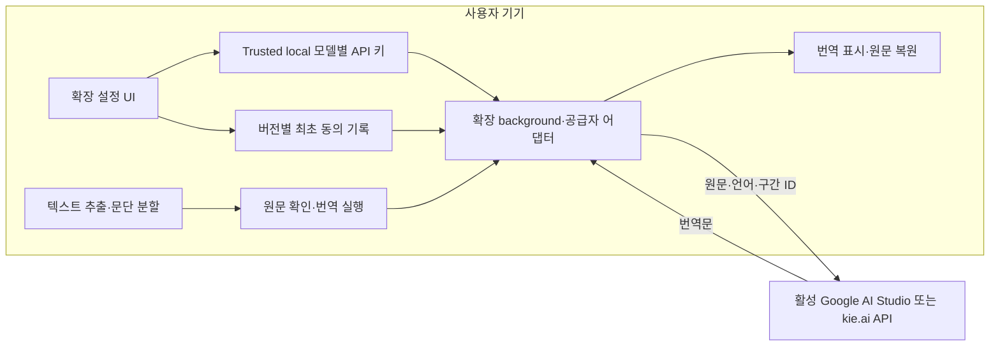

# 0002 — 온디바이스 입출력과 확장 직접 번역 전체 계획

- 현행 설계: 2026-09-06 사용자 결정에 따라 확장 설정 UI에서 API 키를 입력하고 공급자 API를 직접 호출한다.
- 최신 표시 개선 0.14.1: 모델명 옆 입출력 가격·구분 색·320px 이상 좁은 화면 검증은 [0023](0023-compact-model-price-layout.md)을 따른다.
- 최신 0.14.0: kie.ai Chat 34개 모델과 공식 공개 가격 갱신·USD 카드 표시. [0022](0022-kie-live-pricing-and-chat-models.md)를 따른다. 가격은 설정 화면에서만 조회하며 텍스트·자막 번역과 키 보관 범위는 유지한다.
- 최신 0.13.0은 kie.ai 초기 10개 모델의 텍스트·자막 번역, 공급자·계열별 모델 카드·검색, 토큰 축약을 구현했다. 이미지 번역은 Google에 유지한다. 범위·보안·검증은 [0021](0021-kie-provider-and-model-browser.md)을 따른다.
- 0.12.0은 실제 응답의 입력·출력·추론·전체 토큰을 날짜/모델/기능별로 기록한다. 별도 통계 페이지와 팝업의 오늘 요약, 미확인 처리·기록 삭제·보안 검증은 [0020](0020-token-usage-statistics.md)을 따른다.
- 로컬 서버는 계획에서 제거했다. 전환 구현·검증은 [0004](0004-extension-direct-api.md)에 기록한다.
- 동의는 설치·업데이트 버전별 최초 1회 받고 모델은 API 목록에서 선택한다. 구현·검증은 [0005](0005-consent-and-model-list.md)에 기록한다.
- 0.4.0에서 출시일 최근순 정렬과 공급자·모델별 키 영구 저장을 적용한다. 보안 정책·검증은 [0006](0006-model-profiles-and-security.md)에 기록한다.
- 0.5.0에서 우클릭 선택 번역, 본문 노드 교체/복원, 최대 64구간 구조화 묶음을 적용한다. 구현·검증은 [0007](0007-context-menu-layout-batching.md)에 기록한다.
- 0.6.0에서 선택 오버레이·본문 ON/OFF·탭 수명 결과 캐시를 적용한다. 구현·검증은 [0008](0008-selection-overlay-and-page-toggle.md)에 기록한다.
- 0.7.0은 사용자 요청에 따라 이미지 우클릭·멀티모달 인식/번역·오버레이를 구현한다. 이미지 인식 방식과 전송 범위 변경은 [0009](0009-multimodal-image-translation.md)를 따른다.
- 0.8.0은 YouTube 자막 목록·구조화 번역·영상 시간 기반 반투명 오버레이를 구현한다. 서버 없이 자막 텍스트만 전송하며 범위와 검증은 [0010](0010-youtube-caption-translation.md)을 따른다.
- 0.8.1은 HTTP 200/빈 자막 본문을 정상 플레이어 응답 관찰로 재시도하고 XML 포맷과 단계별 오류 안내를 추가한다. 재현·수정·검증은 [0011](0011-youtube-empty-caption-response.md)을 따른다.
- 최초 텍스트 코드는 구현했으나 실제 Chrome 설치·Google 계정 연동 검증은 별도로 남아 있다.
- 0.9.0은 번역 ON 동안 새 자막 구간을 자동 수집·번역하고 OFF에서 요청/표시를 멈춘다. 자막 불투명도·서체·크기·위치 설정을 저장한다. 구현·검증은 [0012](0012-continuous-captions-and-style.md)를 따른다.
- 0.10.0은 YouTube 좋아요 묶음 옆 자막 번역 버튼을 자동 표시한다. YouTube 전용 권한·문서 고정 진입과 구현·검증은 [0013](0013-youtube-inline-launcher.md)를 따른다.
- 0.10.1은 원문 자막 OFF의 초기 트랙 준비·정체 모듈 복구·실패 목록 재열기를 보완한다. 새로고침 없는 재시도 검증은 [0014](0014-caption-cold-start-recovery.md)에 기록한다.
- 0.10.2는 페이지 버튼의 테마·크기 및 SPA 클릭/후속 요청 경로를 수정한다. 구현과 검증은 [0015](0015-launcher-theme-size-click.md)에 기록한다.

## 1. 요구사항과 우선순위

| 항목 | 방향 |
| --- | --- |
| 화면 입력·출력 | 온디바이스 |
| 번역 | LLM API |
| 첫 대상 | 텍스트 |
| 추가 대상 | 이미지 0.7.0, YouTube 자막 0.8.0 구현. 다른 영상 플랫폼은 후속 범위 |
| 첫 공급자 | Google AI Studio |
| 추가 공급자 | kie.ai 0.13.0 구현, OpenAI 직접 연동은 후속 |
| API 키 | 사용자 입력, 공급자·모델별 trusted local 영구 저장 |
| 모델 | Google API / kie.ai 공식 문서 지원 목록, 카드 검색·계열 필터, 공식 출시일 최근순·미확인 마지막 |
| 전송 동의 | 설치·업데이트된 확장 버전마다 최초 1회 |
| 실행 구성 | Chrome 확장 단독. 로컬 서버 없음 |

## 2. 구조

화면 입력은 DOM·선택 영역에서 원문을 읽는 과정이고 출력은 번역 결과를 표시하는 과정이다. 둘 다 기기에서 수행한다. 텍스트 번역에는 화면 캡처·OCR을 사용하지 않는다. 번역 대상 원문은 API에 전송된다.

## 3. 설정과 사용자 흐름

1. 확장 설정에서 공급자와 해당 API 키를 입력하고 출시일 최근순 모델 카드에서 선택해 해당 모델에 저장한다. 재시작 후 저장 모델을 선택·활성화할 수 있다. 목록 조회는 원문 없는 메타데이터 요청이며 저장·활성화는 추가 API를 호출하지 않는다. kie.ai 공개 목록 조회는 키 유효성 검사가 아니다.
2. 버전별 최초 동의 후 부분 번역은 텍스트 선택 → 우클릭 메뉴, 본문 번역은 확장 팝업에서 연다. 설정이 필요하면 설정 화면에서 완료한 뒤 메뉴를 다시 실행한다.
3. 선택 번역은 메뉴에서 즉시 실행하고 원문 위 오버레이로 표시한다. 본문은 원문·구간 수·문자 수·공급자·언어를 확인하고 시작한다. 반복 실행·재시도에는 동의를 다시 묻지 않는다.
4. 본문 번역은 원래 Text 노드의 값만 교체해 태그·CSS·이벤트를 유지한다. ON/OFF로 추가 요청 없이 번역/원문을 전환하며 페이지의 후속 변경을 덮어쓰지 않는다.
5. 진행·취소·실패 구간 재시도·본문 패널 축소를 제공한다. 본문 결과는 탭별 마지막 페이지에 임시 보관하고 동일 URL·모델 revision·언어·원문이면 새로고침 뒤에도 재사용한다. 탭 종료·브라우저 재시작·확장 재로드에서 제거한다.

키는 공급자·모델별로 trusted local에 영구 저장한다. 키 교체·삭제와 모델 활성화는 진행 중 요청을 취소하고 설정 버전을 변경한다. 저장된 키를 화면이나 content 응답에 다시 출력하지 않는다. 키가 없는 모델에 다른 모델의 키를 자동으로 적용하지 않는다.

동의한 확장 버전도 trusted local에 별도로 보관한다. 업데이트·재설치에는 다시 동의를 받는다. 카탈로그는 trusted session에서 조회 키와 연결하며 새 모델 저장·키 교체는 조회된 모델만 허용한다. 출시일은 공식 기록과 정확한 ID로 연결하고 미확인·가변 별칭에 날짜를 추측하지 않는다.

## 4. 텍스트 범위

- 일반 HTTP(S) 웹페이지의 표시된 메인 문서 텍스트와 선택 영역을 지원한다.
- 본문은 폼·비밀번호·편집·숨김·확장 UI·미디어·iframe·Shadow DOM·canvas를 제외한다. 우클릭 선택은 브라우저가 전달한 비편집 메인 프레임 텍스트만 사용한다. PDF·브라우저 내부 페이지는 제외한다.
- 인라인 경계 공백과 원래 요소·노드·링크·이벤트를 유지하고 본문 Text.nodeValue만 바꾼다. 원문 문자열은 복원용 작업 메모리와 사용자 요청에 따른 trusted session 캐시에 보관한다. 선택 번역은 문서 메모리만 사용한다.
- 큰 본문은 제한 내에서 수집하고 일부 수집이면 안내한다. 동적 추가 내용은 사용자가 재실행한다.
- 번역 응답은 텍스트로만 표시한다. 페이지·모델 응답의 지시를 코드로 실행하지 않는다.

## 5. 공통 계약과 안정성

요청은 작업 ID·공급자·모델·설정 버전·언어·구간 ID와 원문을 포함한다. DOM 참조·URL·쿠키·API 키는 content의 번역 요청 계약에 넣지 않는다. background가 저장소에서 키를 읽어 공급자 인증 헤더로 사용한다.

응답은 작업 ID·구간 ID와 번역문·선택적 숫자 사용량을 반환한다. 누락·중복·알 수 없는 구간, 빈 응답·크기 초과·잘못된 형식은 거절한다.

- 노드/긴 원문 분할 → 최대 64구간·12,000 코드 단위의 구조화 묶음 → JSON 스키마 응답 → ID로 원래 노드에 연결. 작업 내 동일 원문 캐시를 사용한다.
- 대기 → 진행 → 완료/부분 실패/실패/취소 상태.
- 제한된 재시도와 시간 제한. 취소 이후 늦은 응답을 적용하지 않는다.
- 원문 변경·노드 제거·문서 이동·새 작업·설정 변경 검사.
- background 재시작 후 grant와 호출 예산은 세션 저장소에서 복원한다. 중단된 원문 작업을 자동으로 영구 복구하지 않는다.
- 실행 중 단기 원문·번역 캐시만 사용하고 페이지 간 영구 캐시는 두지 않는다.

## 6. 공급자와 이후 단계

| 단계 | 구현 범위 | 완료 기준 |
| --- | --- | --- |
| 1 | 확장 설정·키 관리·Google 직접 호출 | 모델별 영구 저장·전환·삭제, 저장/전환 시 호출 없음, 일반 페이지에 키 비노출 |
| 2 | 우클릭 선택 텍스트 번역 | 클릭 당시 선택 원문만 전송, 탭/문서 고정, 오류·취소 처리 |
| 3 | 본문 번역 | 제외 규칙, 분할·부분 실패·복원·늦은 응답 차단 |
| 4 | 설치·사용·품질 검증 | 코드 테스트, 브라우저 UI, 실제 계정 호출·사이트 호환성 확인 |
| 5 | kie.ai 0.13.0 / 후속 OpenAI | Kie chat/messages/responses 어댑터·모델 카드 구현, 직접 OpenAI는 후속 |
| 6 | 이미지 (0.7.0) | 기기 내 수집·재인코딩 → Google 멀티모달 인식/번역 → 이미지 위 오버레이 |
| 7 | YouTube 자막 (0.8.0) | 제작자/자동 생성 자막 추출, 구조화 번역·재생 시간 동기화·반투명 오버레이 |
| 8 | 연속 자막·표시 설정 (0.9.0) | ON 중 새 구간 자동 번역, OFF 취소·재사용, 자막 모양 조절·설정 저장 |
| 9 | YouTube 페이지 버튼 (0.10.0) | 좋아요 옆 자동 표시, SPA/영역 교체 대응, 기존 자막 패널·상태 유지 |

OpenAI 직접 연동과 다른 영상 플랫폼은 후속 범위다. UI에서 Google/kie.ai를 선택하며 오류 시 다른 공급자로 자동 전송하지 않는다. Kie 이미지 번역은 현재 미지원이다. 모델·SDK 호환성을 임의 가정하지 않는다.

## 7. 보안·검증 기준

- 키는 사용자 설정 입력으로만 공급하며 번들·로그·일반 페이지·content script에 노출하지 않는다.
- 공급자 고정 HTTPS 호스트만 허용하고 임의 URL·리디렉션·쿠키를 배제한다.
- 호출 횟수·동시성·입력 예산을 기기 내에서 검사한다. 설정 변경으로 예산을 초기화하지 않는다.
- 저장·교체·삭제, 설정 변경 중 응답, 잘못된 요청, 모델 오류·네트워크·타임아웃·응답 크기·취소를 모의 API로 검증한다.
- 실제 DOM에서 추출·복원·안전한 표시를 검증한다. 실제 Chrome 설치와 계정 호출 검증은 구분하여 기록한다.
- 실제 키와 비민감 테스트 문장을 이용한 호출은 사용자 허가 아래 수행한다.

## 8. 후속 미디어와 서버 재검토

이미지는 0.7.0 사용자 요청으로 기기 내 수집/축소/재인코딩 후 픽셀을 Google 멀티모달 모델에 보내는 방식으로 변경했다. 인식 원문과 번역문을 구조화 응답으로 받고 기기에서 표시한다. 이미지 URL·전체 화면·메타데이터는 전송하지 않는다. 동영상은 접근 가능한 자막을 다루며 음성 인식·더빙·영상 업로드는 포함하지 않는다. 접근 불가 자막은 지원 불가로 안내한다.

서버는 예정 구성에 포함하지 않는다. 실제 API·브라우저 제약으로 기술적으로 꼭 필요해지면 그 근거와 확장 단독 대안의 한계를 먼저 사용자에게 알린다.

모든 단계는 구현계획 작성 → 구현 → 검증·문서 반영 순서로 진행한다. 과거 서버 기반 구현 이력은 [0003](0003-text-google-implementation.md)에 보존하지만 현행 설계를 지시하지 않는다.

최신 0.11.0 변경은 [0016 — UI 완전 숨김과 Shorts](0016-hidden-panel-and-shorts.md)에 기록한다. Shorts의 제공되는 자막, 활성 플레이어 식별과 영상별 종료를 지원하며 숨긴 패널은 ON/결과를 유지한 채 복원한다.

최신 0.11.1은 [0017 — 재열기와 닫기](0017-caption-panel-reopen.md)를 따른다. 기존 패널은 로컬 복원하며 닫기는 숨김으로 통일한다.

최신 0.11.2 기준: [0018 — 최초 열기와 토글](0018-first-open-and-toggle.md). 초기 UI 주입/위치/오류 복구를 보완하고 페이지 버튼을 표시 토글로 변경한다.

최신 0.11.3은 [0019 — 재생 직후 UI 수명](0019-playback-start-panel-lifecycle.md)을 따른다. 같은 영상의 일시적인 media 노드 변경과 설정 패널의 수명을 분리한다.
